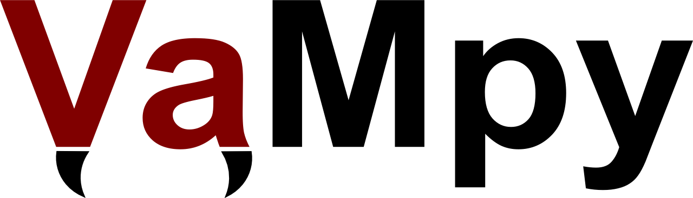

An implementation of finite difference methods (FDM) to solve partial differential equations (PDE).

The first method to be implemented is Richtmyer's 2 step Lax-Wendroff method.

This is the README file for the project.


---------------------------------------
Installation
---------------------------------------

The package is available on Github. To clone the package run

```
git clone https://github.com/akdiem/VaMpy.git
```

To ensure all package dependencies are met it is easiest to set up a new Anaconda environment for VaMpy. This step is optional. The file vampy.yml can be used for this by calling

```
conda env create -f vampy.yml
source activate vampy
```

The first command creates the Anaconda environment ```vampy``` which contains all required packages, whilst the second command sets the current terminal to use this environment. To install VaMpy run

```
python setup.py
```

---------------------------------------
Module Documentation
---------------------------------------

The module documentation can be found on 

[http://akdiem.github.io/vampy/](http://akdiem.github.io/vampy/)
